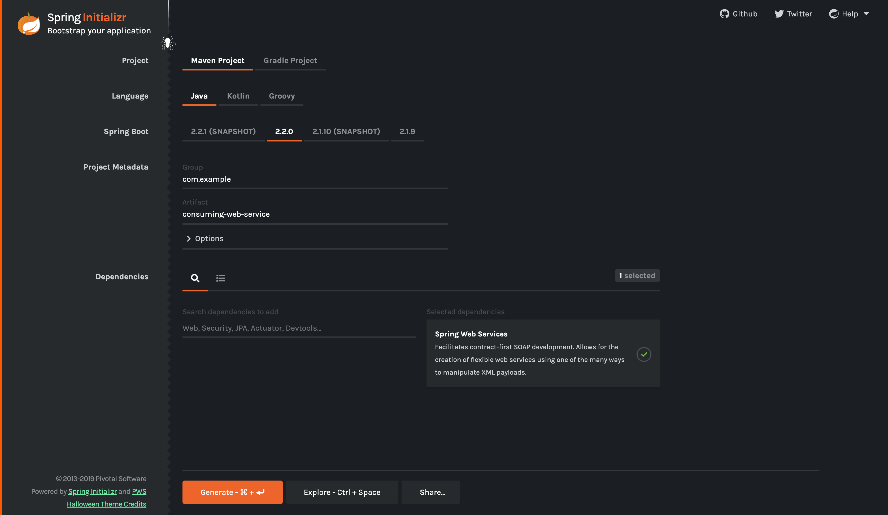

:spring_version: current
:toc:
:project_id: gs-consuming-web-service
:spring_version: current
:spring_boot_version: 2.2.1.RELEASE
:icons: font
:source-highlighter: prettify

This guide walks you through the process of consuming a SOAP-based web service with
Spring.

== What You Will Build

You will build a client that fetches country data data from a remote, WSDL-based web
service by using http://en.wikipedia.org/wiki/SOAP[SOAP].
You can find out more about the country service and run the service yourself by following
https://spring.io/guides/gs/producing-web-service/[this guide].

The service provides country data. You will be able to query data about a country based on its name.

== What You Need

:java_version: 1.8
include::https://raw.githubusercontent.com/spring-guides/getting-started-macros/master/prereq_editor_jdk_buildtools.adoc[]

include::https://raw.githubusercontent.com/spring-guides/getting-started-macros/master/how_to_complete_this_guide.adoc[]

NOTE: If you read link:/guides/gs/producing-web-service[Producing a SOAP web service], you
might wonder why this guide does not use `spring-boot-starter-ws`? That Spring Boot
starter is only for server-side web services. That starter brings on board such things as
embedded Tomcat, which is not needed to make a web call.

== Run the Target Web Service Locally

Follow the steps in the
https://spring.io/guides/gs/producing-web-service/[companion guide] or clone the
https://github.com/spring-guides/gs-producing-web-service[repository] and run the service
(for example, by using `mvn spring-boot:run`) from its `complete` directory. You can
verify that it works by visiting `http://localhost:8080/ws/countries.wsdl` in your
browser. If you don't do this you will see a confusing exception in your build later from the JAXB tooling.

[[scratch]]
== Starting with Spring Initializr

For all Spring applications, you should start with the https://start.spring.io[Spring
Initializr]. The Initializr offers a fast way to pull in all the dependencies you need for
an application and does a lot of the setup for you. This example needs only the Spring Web
Services dependency. The following image shows the Initializr set up for this sample
project:

NOTE: The preceding image shows the Initializr with Maven chosen as the build tool. You
can also use Gradle. It also shows values of `com.example` and `consuming-web-service` as
the Group and Artifact, respectively. You will use those values throughout the rest of
this sample.

The following listing shows the `pom.xml` file that is created when you choose Maven:

====
[source,xml]
----
include::initial/pom.xml[]
----
====

The following listing shows the `build.gradle` file that is created when you choose Gradle:

====
[source,text]
----
include::initial/build.gradle[]
----
====

== Modify the Build Files

The build files created by the Spring Initializr need quite a bit of work for this guide.
Also, the modifications to `pom.xml` (for Maven) and `build.gradle` (for Gradle) differ
substantially.

=== Maven

For Maven, you need to add a dependency, a profile, and a WSDL generation plugin.

The following listing shows the dependency you need to add in Maven:

====
[source,xml,indent=0]
----
include::complete/pom.xml[tags=dependency]
----
====

The following listing shows the profile you need to add in Maven if you want it to work with Java 11:

====
[source,xml,indent=0]
----
include::complete/pom.xml[tags=profile]
----
====

The <<initial>> section describes the WSDL generation plugin.

The following listing shows the final `pom.xml` file:

====
[source,xml,indent=0]
----
include::complete/pom.xml[]
----
====

=== Gradle

For Gradle, you need to add a dependency, a configuration, a `bootJar` section, and a WSDL
generation plugin.

The following listing shows the dependency you need to add in Gradle:

====
[source,xml,indent=0]
----
include::complete/build.gradle[tags=dependency]
----
====

Note the exclusion of Tomcat. If Tomcat is allowed to run in this build, you get a port
collision with the Tomcat instance that provides the country data.

The following listing shows the `bootJar` section you need to add in Gradle:

====
[source,xml,indent=0]
----
include::complete/build.gradle[tags=bootjar]
----
====

The <<initial>> section describes the WSDL generation plugin.

The following listing shows the final `build.gradle` file:

====
[source,xml,indent=0]
----
include::complete/build.gradle[]
----
====

[[initial]]
== Generate Domain Objects Based on a WSDL

The interface to a SOAP web service is captured in
http://en.wikipedia.org/wiki/Web_Services_Description_Language[WSDL]. JAXB provides a way
to generate Java classes from WSDL (or rather, the XSD contained in the `<Types/>` section
of the WSDL). You can find the WSDL for the country service at
`http://localhost:8080/ws/countries.wsdl`.

To generate Java classes from the WSDL in Maven, you need the following plugin setup:

====
[source,xml,indent=0]
----
include::complete/pom.xml[tags=wsdl]
----
====

This setup will generate classes for the WSDL found at the specified URL, putting those
classes in the `com.example.consumingwebservice.wsdl` package. To generate that code run `./mvnw compile`
and then look in `target/generated-sources` if you want to check that it worked.

To do the same with Gradle, you will need the following in your build file:

====
[source,java,tabsize=2,indent=0]
----
include::complete/build.gradle[tags=wsdl]
----
====

As Gradle does not (yet) have a JAXB plugin, it involves an Ant task, which makes it a bit
more complex than in Maven. To generate that code run `./gradlew compileJava`
and then look in `build/generated-sources` if you want to check that it worked.

In both cases, the JAXB domain object generation process has been wired into the build
tool's lifecycle, so you need not run any extra steps once you have a successful build.

== Create a Country Service Client

To create a web service client, you have to extend the
http://docs.spring.io/spring-ws/sites/2.0/apidocs/org/springframework/ws/client/core/support/WebServiceGatewaySupport.html[`WebServiceGatewaySupport`]
class and code your operations, as the following example (from
`src/main/java/com/example/consumingwebservice/CountryClient.java`) shows:

====
[source,java,tabsize=2]
----
include::complete/src/main/java/com/example/consumingwebservice/CountryClient.java[]
----
====

The client contains one method (`getCountry`) that does the actual SOAP exchange.

In this method, both the `GetCountryRequest` and the `GetCountryResponse` classes are
derived from the WSDL and were generated in the JAXB generation process (described in
<<initial>>). It creates the `GetCountryRequest` request object and sets it up with the
`country` parameter (the name of the country). After printing out the country name, it
uses the
http://docs.spring.io/spring-ws/sites/2.0/apidocs/org/springframework/ws/client/core/WebServiceTemplate.html[`WebServiceTemplate`]
supplied by the `WebServiceGatewaySupport` base class to do the actual SOAP exchange. It
passes the `GetCountryRequest` request object (as well as a `SoapActionCallback` to pass
on a http://www.w3.org/TR/2000/NOTE-SOAP-20000508/#_Toc478383528[SOAPAction] header with
the request) as the WSDL described that it needed this header in the `<soap:operation/>`
elements. It casts the response into a `GetCountryResponse` object, which is then
returned.

== Configuring Web Service Components

Spring WS uses Spring Framework's OXM module, which has the `Jaxb2Marshaller` to serialize
and deserialize XML requests, as the following example (from
`src/main/java/com/example/consumingwebservice/CountryConfiguration.java`) shows:

====
[source,java,tabsize=2]
----
include::complete/src/main/java/com/example/consumingwebservice/CountryConfiguration.java[]
----
====

The `marshaller` is pointed at the collection of generated domain objects and will use
them to both serialize and deserialize between XML and POJOs.

The `countryClient` is created and configured with the URI of the country service shown
earlier. It is also configured to use the JAXB marshaller.

== Run the Application

This application is packaged up to run from the console and retrieve the data for a given
country name, as the following listing (from
`src/main/java/com/example/consumingwebservice/ConsumingWebServiceApplication.java`)
shows:

====
[source,java,tabsize=2]
----
include::complete/src/main/java/com/example/consumingwebservice/ConsumingWebServiceApplication.java[]
----
====

The `main()` method defers to the
http://docs.spring.io/spring-boot/docs/{spring_boot_version}/api/org/springframework/boot/SpringApplication.html[`SpringApplication`] helper class, providing
`CountryConfiguration.class` as an argument to its `run()` method. This tells Spring to
read the annotation metadata from `CountryConfiguration` and to manage it as a component
in the Spring application context.

NOTE: This application is hard-coded to look up 'Spain'. Later in this guide, you will see
how to enter a different symbol without editing the code.

include::https://raw.githubusercontent.com/spring-guides/getting-started-macros/master/build_an_executable_jar_subhead.adoc[]

include::https://raw.githubusercontent.com/spring-guides/getting-started-macros/master/build_an_executable_jar_with_both.adoc[]

Logging output is displayed. The service should be up and running within a few seconds.

The following listing shows the initial response:

====
[source]
----
Requesting country data for Spain

<getCountryRequest><name>Spain</name>...</getCountryRequest>
----
====

You can plug in a different country by running the following command:

====
[source,bash]
----
java -jar build/libs/gs-consuming-web-service-0.1.0.jar Poland
----
====

Then the response changes to the following:

====
[source]
----
Requesting location for Poland

<getCountryRequest><name>Poland</name>...</getCountryRequest>
----
====

== Summary

Congratulations! You have just developed a client to consume a SOAP-based web service with
Spring.

== See Also

The following guides may also be helpful:

* https://spring.io/guides/gs/producing-web-service/[Producing a SOAP web service]
* https://spring.io/guides/gs/spring-boot/[Building an Application with Spring Boot]

include::https://raw.githubusercontent.com/spring-guides/getting-started-macros/master/footer.adoc[]
